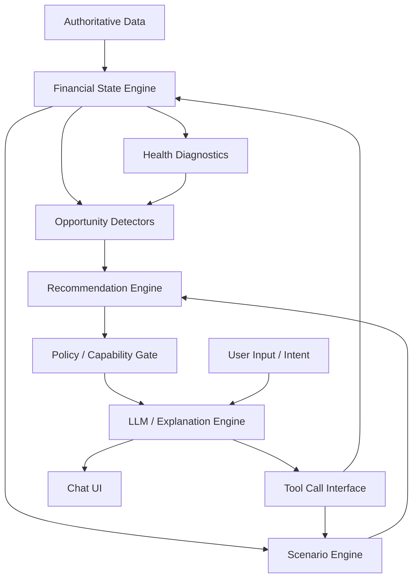

# Intelligence Architecture

## Overview

"Financial Intelligence" in SyncVista is not an LLM chatbot layered over a database. It is a structured hierarchy of deterministic engines, opportunity detectors, and policy gates, culminating in an LLM used strictly for *natural language routing and explanation*.

## The Intelligence Hierarchy

The proposed architecture follows a strict, multi-tiered pipeline:

### A. FINANCIAL STATE (The Foundation)
The deterministic facts of the user's financial life.
- **Outputs:** Net worth, liquid capital, investments, liabilities, categorized cash flows.
- **Source:** Setu AA, Firebase, `packages/fire-engine`.

### B. FINANCIAL HEALTH (The Diagnostician)
Evaluates the State against established thresholds.
- **Outputs:** Liquidity runway (months), savings rate, debt-to-income, sector concentration risk (HHI), FIRE readiness score.
- **Source:** `analytics/engine.ts`, `ProtectionScoreOutput`.

### C. OPPORTUNITY DETECTION (The Scanner)
Continuously scans State and Health for optimization vectors.
- **Outputs:** "You have ₹2,00,000 excess cash", "Your HDFC loan is at 14%, prepay it", "You have ₹50k in STCG harvestable losses".
- **Source:** Dedicated deterministic detectors (e.g., `detectSubscriptions`, `tax-harvest.ts`).

### D. SCENARIO ENGINE (The Sandbox)
Answers "What if?" strictly via deterministic simulation.
- **Outputs:** Updated FIRE horizon if investing ₹25k more; revised debt clearance month via Avalanche vs Snowball.
- **Source:** `monte-carlo.ts`, `debt-engine.ts`.

### E. RECOMMENDATION ENGINE (The Brain)
Ranks and structures detected opportunities into actionable recommendations.
- **Outputs:** Structured candidate actions (`recommendationId`, `action`, `confidence`, `expectedImpact`).
- **Source:** New `recommendation-engine` (Deterministic scoring).

### F. POLICY / CAPABILITY GATE (The Guardrail)
Filters recommendations based on tier (B2C, B2B, Private), jurisdiction, and compliance rules.
- **Outputs:** Approved recommendation list.
- **Source:** Policy enforcement middleware.

### G. EXPLANATION ENGINE (The Voice)
The LLM layer. It translates the approved, deterministic recommendation into personalized natural language.
- **Source:** Cohere / Gemini / LLM Provider.

### H. CONVERSATIONAL INTERFACE (The Frontend)
The chat UI where the user interacts with the Explanation Engine.

## Dependency Flow

## Architectural Verdict
The current architecture skips B, C, D, E, and F entirely, connecting Data directly to LLM. Step 2 requires building out the middle layers before upgrading the LLM prompt. The LLM must become a consumer of `RecEngine` and `ScenarioEngine`, not a substitute for them.
